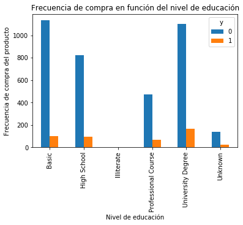
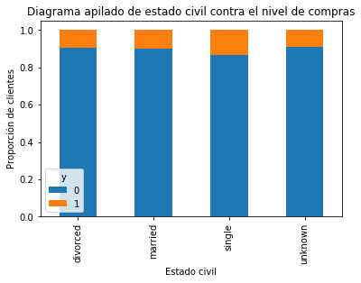
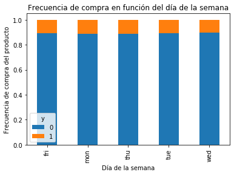
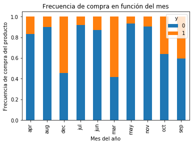
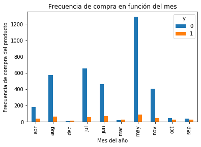
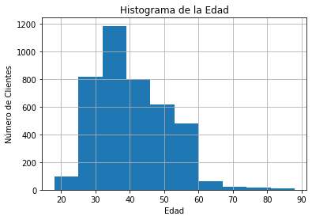
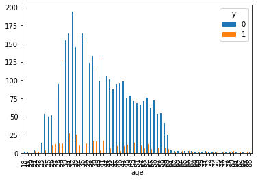
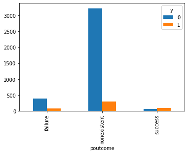
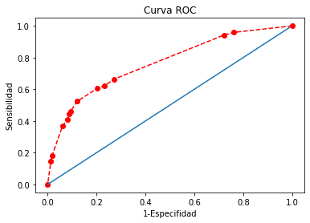
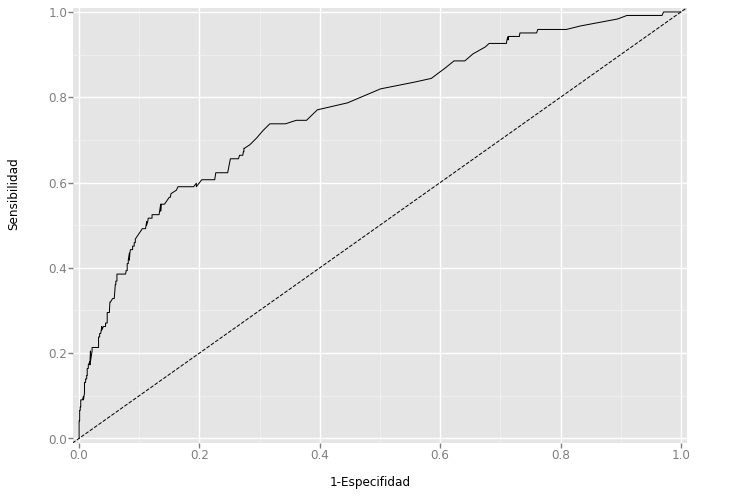

# Regresión logística para predicciones bancarias


```python
import pandas as pd
import numpy as np
import matplotlib.pyplot as plt
```


```python
data = pd.read_csv("../datasets/bank/bank.csv", sep=";")
```


```python
data.head()
```


<div>
<style scoped>
    .dataframe tbody tr th:only-of-type {
        vertical-align: middle;
    }

    .dataframe tbody tr th {
        vertical-align: top;
    }

    .dataframe thead th {
        text-align: right;
    }
</style>
<table border="1" class="dataframe">
  <thead>
    <tr style="text-align: right;">
      <th></th>
      <th>age</th>
      <th>job</th>
      <th>marital</th>
      <th>education</th>
      <th>default</th>
      <th>housing</th>
      <th>loan</th>
      <th>contact</th>
      <th>month</th>
      <th>day_of_week</th>
      <th>...</th>
      <th>campaign</th>
      <th>pdays</th>
      <th>previous</th>
      <th>poutcome</th>
      <th>emp.var.rate</th>
      <th>cons.price.idx</th>
      <th>cons.conf.idx</th>
      <th>euribor3m</th>
      <th>nr.employed</th>
      <th>y</th>
    </tr>
  </thead>
  <tbody>
    <tr>
      <td>0</td>
      <td>30</td>
      <td>blue-collar</td>
      <td>married</td>
      <td>basic.9y</td>
      <td>no</td>
      <td>yes</td>
      <td>no</td>
      <td>cellular</td>
      <td>may</td>
      <td>fri</td>
      <td>...</td>
      <td>2</td>
      <td>999</td>
      <td>0</td>
      <td>nonexistent</td>
      <td>-1.8</td>
      <td>92.893</td>
      <td>-46.2</td>
      <td>1.313</td>
      <td>5099.1</td>
      <td>no</td>
    </tr>
    <tr>
      <td>1</td>
      <td>39</td>
      <td>services</td>
      <td>single</td>
      <td>high.school</td>
      <td>no</td>
      <td>no</td>
      <td>no</td>
      <td>telephone</td>
      <td>may</td>
      <td>fri</td>
      <td>...</td>
      <td>4</td>
      <td>999</td>
      <td>0</td>
      <td>nonexistent</td>
      <td>1.1</td>
      <td>93.994</td>
      <td>-36.4</td>
      <td>4.855</td>
      <td>5191.0</td>
      <td>no</td>
    </tr>
    <tr>
      <td>2</td>
      <td>25</td>
      <td>services</td>
      <td>married</td>
      <td>high.school</td>
      <td>no</td>
      <td>yes</td>
      <td>no</td>
      <td>telephone</td>
      <td>jun</td>
      <td>wed</td>
      <td>...</td>
      <td>1</td>
      <td>999</td>
      <td>0</td>
      <td>nonexistent</td>
      <td>1.4</td>
      <td>94.465</td>
      <td>-41.8</td>
      <td>4.962</td>
      <td>5228.1</td>
      <td>no</td>
    </tr>
    <tr>
      <td>3</td>
      <td>38</td>
      <td>services</td>
      <td>married</td>
      <td>basic.9y</td>
      <td>no</td>
      <td>unknown</td>
      <td>unknown</td>
      <td>telephone</td>
      <td>jun</td>
      <td>fri</td>
      <td>...</td>
      <td>3</td>
      <td>999</td>
      <td>0</td>
      <td>nonexistent</td>
      <td>1.4</td>
      <td>94.465</td>
      <td>-41.8</td>
      <td>4.959</td>
      <td>5228.1</td>
      <td>no</td>
    </tr>
    <tr>
      <td>4</td>
      <td>47</td>
      <td>admin.</td>
      <td>married</td>
      <td>university.degree</td>
      <td>no</td>
      <td>yes</td>
      <td>no</td>
      <td>cellular</td>
      <td>nov</td>
      <td>mon</td>
      <td>...</td>
      <td>1</td>
      <td>999</td>
      <td>0</td>
      <td>nonexistent</td>
      <td>-0.1</td>
      <td>93.200</td>
      <td>-42.0</td>
      <td>4.191</td>
      <td>5195.8</td>
      <td>no</td>
    </tr>
  </tbody>
</table>
<p>5 rows × 21 columns</p>
</div>


```python
data.shape
```


    (4119, 21)


```python
data.columns.values
```


    array(['age', 'job', 'marital', 'education', 'default', 'housing', 'loan',
           'contact', 'month', 'day_of_week', 'duration', 'campaign', 'pdays',
           'previous', 'poutcome', 'emp.var.rate', 'cons.price.idx',
           'cons.conf.idx', 'euribor3m', 'nr.employed', 'y'], dtype=object)


**Todos se emplea para catalogar la "y", que es si acaba comprando el producto de inversión o no. Estos datos están como yes/no, los vamos a para a 1 los "yes" y a 0 los "no"**


```python
data["y"] = (data["y"]=="yes").astype(int)
```


```python
data.tail()
```


<div>
<style scoped>
    .dataframe tbody tr th:only-of-type {
        vertical-align: middle;
    }

    .dataframe tbody tr th {
        vertical-align: top;
    }

    .dataframe thead th {
        text-align: right;
    }
</style>
<table border="1" class="dataframe">
  <thead>
    <tr style="text-align: right;">
      <th></th>
      <th>age</th>
      <th>job</th>
      <th>marital</th>
      <th>education</th>
      <th>default</th>
      <th>housing</th>
      <th>loan</th>
      <th>contact</th>
      <th>month</th>
      <th>day_of_week</th>
      <th>...</th>
      <th>campaign</th>
      <th>pdays</th>
      <th>previous</th>
      <th>poutcome</th>
      <th>emp.var.rate</th>
      <th>cons.price.idx</th>
      <th>cons.conf.idx</th>
      <th>euribor3m</th>
      <th>nr.employed</th>
      <th>y</th>
    </tr>
  </thead>
  <tbody>
    <tr>
      <td>4114</td>
      <td>30</td>
      <td>admin.</td>
      <td>married</td>
      <td>basic.6y</td>
      <td>no</td>
      <td>yes</td>
      <td>yes</td>
      <td>cellular</td>
      <td>jul</td>
      <td>thu</td>
      <td>...</td>
      <td>1</td>
      <td>999</td>
      <td>0</td>
      <td>nonexistent</td>
      <td>1.4</td>
      <td>93.918</td>
      <td>-42.7</td>
      <td>4.958</td>
      <td>5228.1</td>
      <td>0</td>
    </tr>
    <tr>
      <td>4115</td>
      <td>39</td>
      <td>admin.</td>
      <td>married</td>
      <td>high.school</td>
      <td>no</td>
      <td>yes</td>
      <td>no</td>
      <td>telephone</td>
      <td>jul</td>
      <td>fri</td>
      <td>...</td>
      <td>1</td>
      <td>999</td>
      <td>0</td>
      <td>nonexistent</td>
      <td>1.4</td>
      <td>93.918</td>
      <td>-42.7</td>
      <td>4.959</td>
      <td>5228.1</td>
      <td>0</td>
    </tr>
    <tr>
      <td>4116</td>
      <td>27</td>
      <td>student</td>
      <td>single</td>
      <td>high.school</td>
      <td>no</td>
      <td>no</td>
      <td>no</td>
      <td>cellular</td>
      <td>may</td>
      <td>mon</td>
      <td>...</td>
      <td>2</td>
      <td>999</td>
      <td>1</td>
      <td>failure</td>
      <td>-1.8</td>
      <td>92.893</td>
      <td>-46.2</td>
      <td>1.354</td>
      <td>5099.1</td>
      <td>0</td>
    </tr>
    <tr>
      <td>4117</td>
      <td>58</td>
      <td>admin.</td>
      <td>married</td>
      <td>high.school</td>
      <td>no</td>
      <td>no</td>
      <td>no</td>
      <td>cellular</td>
      <td>aug</td>
      <td>fri</td>
      <td>...</td>
      <td>1</td>
      <td>999</td>
      <td>0</td>
      <td>nonexistent</td>
      <td>1.4</td>
      <td>93.444</td>
      <td>-36.1</td>
      <td>4.966</td>
      <td>5228.1</td>
      <td>0</td>
    </tr>
    <tr>
      <td>4118</td>
      <td>34</td>
      <td>management</td>
      <td>single</td>
      <td>high.school</td>
      <td>no</td>
      <td>yes</td>
      <td>no</td>
      <td>cellular</td>
      <td>nov</td>
      <td>wed</td>
      <td>...</td>
      <td>1</td>
      <td>999</td>
      <td>0</td>
      <td>nonexistent</td>
      <td>-0.1</td>
      <td>93.200</td>
      <td>-42.0</td>
      <td>4.120</td>
      <td>5195.8</td>
      <td>0</td>
    </tr>
  </tbody>
</table>
<p>5 rows × 21 columns</p>
</div>


```python
data["education"].unique()
```


    array(['basic.9y', 'high.school', 'university.degree',
           'professional.course', 'basic.6y', 'basic.4y', 'unknown',
           'illiterate'], dtype=object)


```python
#where(haya_esto, "me_pones_esto", y en caso contrario este 3er argumento)

data["education"] = np.where(data["education"]=="basic.4y", "Basic", data["education"])
data["education"] = np.where(data["education"]=="basic.6y", "Basic", data["education"])
data["education"] = np.where(data["education"]=="basic.9y", "Basic", data["education"])

data["education"] = np.where(data["education"]=="high.school", "High School", data["education"])
data["education"] = np.where(data["education"]=="professional.course", "Professional Course", data["education"])
data["education"] = np.where(data["education"]=="university.degree", "University Degree", data["education"])

data["education"] = np.where(data["education"]=="illiterate", "Illiterate", data["education"])
data["education"] = np.where(data["education"]=="unknown", "Unknown", data["education"])
```


```python
data["education"].unique()
```


    array(['Basic', 'High School', 'University Degree', 'Professional Course',
           'Unknown', 'Illiterate'], dtype=object)


```python
data["y"].value_counts()
```


    0    3668
    1     451
    Name: y, dtype: int64


```python
data.groupby("y").mean()
```


<div>
<style scoped>
    .dataframe tbody tr th:only-of-type {
        vertical-align: middle;
    }

    .dataframe tbody tr th {
        vertical-align: top;
    }

    .dataframe thead th {
        text-align: right;
    }
</style>
<table border="1" class="dataframe">
  <thead>
    <tr style="text-align: right;">
      <th></th>
      <th>age</th>
      <th>duration</th>
      <th>campaign</th>
      <th>pdays</th>
      <th>previous</th>
      <th>emp.var.rate</th>
      <th>cons.price.idx</th>
      <th>cons.conf.idx</th>
      <th>euribor3m</th>
      <th>nr.employed</th>
    </tr>
    <tr>
      <th>y</th>
      <th></th>
      <th></th>
      <th></th>
      <th></th>
      <th></th>
      <th></th>
      <th></th>
      <th></th>
      <th></th>
      <th></th>
    </tr>
  </thead>
  <tbody>
    <tr>
      <td>0</td>
      <td>39.895311</td>
      <td>219.40976</td>
      <td>2.605780</td>
      <td>982.763086</td>
      <td>0.141767</td>
      <td>0.240185</td>
      <td>93.599677</td>
      <td>-40.586723</td>
      <td>3.802826</td>
      <td>5175.502072</td>
    </tr>
    <tr>
      <td>1</td>
      <td>41.889135</td>
      <td>560.78714</td>
      <td>1.980044</td>
      <td>778.722838</td>
      <td>0.585366</td>
      <td>-1.177384</td>
      <td>93.417268</td>
      <td>-39.786475</td>
      <td>2.145448</td>
      <td>5093.118625</td>
    </tr>
  </tbody>
</table>
</div>


```python
data.groupby("education").mean()
```


<div>
<style scoped>
    .dataframe tbody tr th:only-of-type {
        vertical-align: middle;
    }

    .dataframe tbody tr th {
        vertical-align: top;
    }

    .dataframe thead th {
        text-align: right;
    }
</style>
<table border="1" class="dataframe">
  <thead>
    <tr style="text-align: right;">
      <th></th>
      <th>age</th>
      <th>duration</th>
      <th>campaign</th>
      <th>pdays</th>
      <th>previous</th>
      <th>emp.var.rate</th>
      <th>cons.price.idx</th>
      <th>cons.conf.idx</th>
      <th>euribor3m</th>
      <th>nr.employed</th>
      <th>y</th>
    </tr>
    <tr>
      <th>education</th>
      <th></th>
      <th></th>
      <th></th>
      <th></th>
      <th></th>
      <th></th>
      <th></th>
      <th></th>
      <th></th>
      <th></th>
      <th></th>
    </tr>
  </thead>
  <tbody>
    <tr>
      <td>Basic</td>
      <td>42.337124</td>
      <td>253.898457</td>
      <td>2.429732</td>
      <td>978.815597</td>
      <td>0.149472</td>
      <td>0.237368</td>
      <td>93.658600</td>
      <td>-41.120552</td>
      <td>3.775701</td>
      <td>5174.133144</td>
      <td>0.079610</td>
    </tr>
    <tr>
      <td>High School</td>
      <td>38.097720</td>
      <td>258.534202</td>
      <td>2.630836</td>
      <td>958.022801</td>
      <td>0.206298</td>
      <td>-0.002497</td>
      <td>93.564314</td>
      <td>-40.995765</td>
      <td>3.511732</td>
      <td>5163.212595</td>
      <td>0.105320</td>
    </tr>
    <tr>
      <td>Illiterate</td>
      <td>42.000000</td>
      <td>146.000000</td>
      <td>4.000000</td>
      <td>999.000000</td>
      <td>0.000000</td>
      <td>-2.900000</td>
      <td>92.201000</td>
      <td>-31.400000</td>
      <td>0.834000</td>
      <td>5076.200000</td>
      <td>0.000000</td>
    </tr>
    <tr>
      <td>Professional Course</td>
      <td>40.207477</td>
      <td>278.816822</td>
      <td>2.512150</td>
      <td>958.211215</td>
      <td>0.194393</td>
      <td>0.163925</td>
      <td>93.599630</td>
      <td>-40.127664</td>
      <td>3.701426</td>
      <td>5167.595140</td>
      <td>0.121495</td>
    </tr>
    <tr>
      <td>University Degree</td>
      <td>39.017405</td>
      <td>247.707278</td>
      <td>2.583070</td>
      <td>947.900316</td>
      <td>0.207278</td>
      <td>-0.009731</td>
      <td>93.499109</td>
      <td>-39.830063</td>
      <td>3.547132</td>
      <td>5163.023180</td>
      <td>0.130538</td>
    </tr>
    <tr>
      <td>Unknown</td>
      <td>42.826347</td>
      <td>267.281437</td>
      <td>2.538922</td>
      <td>939.700599</td>
      <td>0.263473</td>
      <td>-0.074251</td>
      <td>93.637455</td>
      <td>-39.487425</td>
      <td>3.410174</td>
      <td>5151.260479</td>
      <td>0.155689</td>
    </tr>
  </tbody>
</table>
</div>


```python
pd.crosstab(data["education"], data["y"])
```


<div>
<style scoped>
    .dataframe tbody tr th:only-of-type {
        vertical-align: middle;
    }

    .dataframe tbody tr th {
        vertical-align: top;
    }

    .dataframe thead th {
        text-align: right;
    }
</style>
<table border="1" class="dataframe">
  <thead>
    <tr style="text-align: right;">
      <th>y</th>
      <th>0</th>
      <th>1</th>
    </tr>
    <tr>
      <th>education</th>
      <th></th>
      <th></th>
    </tr>
  </thead>
  <tbody>
    <tr>
      <td>Basic</td>
      <td>1133</td>
      <td>98</td>
    </tr>
    <tr>
      <td>High School</td>
      <td>824</td>
      <td>97</td>
    </tr>
    <tr>
      <td>Illiterate</td>
      <td>1</td>
      <td>0</td>
    </tr>
    <tr>
      <td>Professional Course</td>
      <td>470</td>
      <td>65</td>
    </tr>
    <tr>
      <td>University Degree</td>
      <td>1099</td>
      <td>165</td>
    </tr>
    <tr>
      <td>Unknown</td>
      <td>141</td>
      <td>26</td>
    </tr>
  </tbody>
</table>
</div>


```python
%matplotlib inline
pd.crosstab(data.education, data.y).plot(kind="bar") #crosstab era lo de la tabla de contingencia que ya vimos
plt.title("Frecuencia de compra en función del nivel de educación")
plt.xlabel("Nivel de educación")
plt.ylabel("Frecuencia de compra del producto")
```


    Text(0, 0.5, 'Frecuencia de compra del producto')





```python
table=pd.crosstab(data.marital, data.y)
table.div(table.sum(1).astype(float), axis=0).plot(kind="bar", stacked=True) #stacked = True es para que salga apilado
#Con table.div(table.sum(1).astype(float), axis=0) es como arrastrar en excel la columna (axis = 0) 
#para que cada celda quede dividida por la suma de su fila 

plt.title("Diagrama apilado de estado civil contra el nivel de compras")
plt.xlabel("Estado civil")
plt.ylabel("Proporción de clientes")
```


    Text(0, 0.5, 'Proporción de clientes')





```python
%matplotlib inline
table= pd.crosstab(data.day_of_week, data.y)
table.div(table.sum(1).astype(float), axis=0).plot(kind="bar", stacked=True)
plt.title("Frecuencia de compra en función del día de la semana")
plt.xlabel("Día de la semana")
plt.ylabel("Frecuencia de compra del producto")
```


    Text(0, 0.5, 'Frecuencia de compra del producto')





```python
%matplotlib inline
table= pd.crosstab(data.month, data.y)
table.div(table.sum(1).astype(float), axis=0).plot(kind="bar", stacked=True)
plt.title("Frecuencia de compra en función del mes")
plt.xlabel("Mes del año")
plt.ylabel("Frecuencia de compra del producto")
```


    Text(0, 0.5, 'Frecuencia de compra del producto')





*Tal vez es que en marzo y diciembre haya menos datos...*


```python
%matplotlib inline
table.plot(kind="bar", stacked=False)
plt.title("Frecuencia de compra en función del mes")
plt.xlabel("Mes del año")
plt.ylabel("Frecuencia de compra del producto")
```


    Text(0, 0.5, 'Frecuencia de compra del producto')





*Efectivamente. Vemos que se hizo campaña en verano (mayo, junio, julio, agosto) y hubo mucho rechazos*


```python
%matplotlib inline
data.age.hist()
plt.title("Histograma de la Edad")
plt.xlabel("Edad")
plt.ylabel("Número de Clientes")
```


    Text(0, 0.5, 'Número de Clientes')





*Vemos que con menos de 25 y con más de 60 no piensan en invertir (hay muy pocos cliente)*


```python
pd.crosstab(data.age, data.y).plot(kind="bar")
```


    <matplotlib.axes._subplots.AxesSubplot at 0x4e50e770c8>





```python
#poutcome es la frecuencia de compras anteriores
pd.crosstab(data.poutcome, data.y).plot(kind="bar")
```


    <matplotlib.axes._subplots.AxesSubplot at 0x4e52175488>





*poutcome es buena variable para predecir si alguien va a llevar a cabo una inversión. Vemos que la gente que ha tenido malas experiencias (failure) pasadas, no repite, pero los que tuvieron éxito sí que repiten. Los que no han invertido, por defecto no van a invertir aunque alguno dirá que sí (nonexisting)*

### Conversión de las variables categóricas a dummies y borrado de las originales


```python
categories = ["job", "marital", "education", "default", "housing", "loan", "contact", 
              "month", "day_of_week", "poutcome"]
for category in categories:
    cat_dummies = pd.get_dummies(data[category], prefix=category)
    data = data.join(cat_dummies)
```


```python
data.columns.values
```


    array(['age', 'job', 'marital', 'education', 'default', 'housing', 'loan',
           'contact', 'month', 'day_of_week', 'duration', 'campaign', 'pdays',
           'previous', 'poutcome', 'emp.var.rate', 'cons.price.idx',
           'cons.conf.idx', 'euribor3m', 'nr.employed', 'y', 'job_admin.',
           'job_blue-collar', 'job_entrepreneur', 'job_housemaid',
           'job_management', 'job_retired', 'job_self-employed',
           'job_services', 'job_student', 'job_technician', 'job_unemployed',
           'job_unknown', 'marital_divorced', 'marital_married',
           'marital_single', 'marital_unknown', 'education_Basic',
           'education_High School', 'education_Illiterate',
           'education_Professional Course', 'education_University Degree',
           'education_Unknown', 'default_no', 'default_unknown',
           'default_yes', 'housing_no', 'housing_unknown', 'housing_yes',
           'loan_no', 'loan_unknown', 'loan_yes', 'contact_cellular',
           'contact_telephone', 'month_apr', 'month_aug', 'month_dec',
           'month_jul', 'month_jun', 'month_mar', 'month_may', 'month_nov',
           'month_oct', 'month_sep', 'day_of_week_fri', 'day_of_week_mon',
           'day_of_week_thu', 'day_of_week_tue', 'day_of_week_wed',
           'poutcome_failure', 'poutcome_nonexistent', 'poutcome_success'],
          dtype=object)


*Al haber creado las dummies, ahora me sobran las variables categóricas originales (las de la lista "categories"), por tanto las elimino:*


```python
data_vars = data.columns.values.tolist()
to_keep = [v for v in data_vars if v not in categories] #Me quiero quedar con estos

bank_data = data[to_keep]
```

### Selección de rasgos para el modelo

*Qué variables son las más significativas para la predicción del modelo*


```python
n = 12
```


```python
from sklearn import datasets
from sklearn.feature_selection import RFE
from sklearn.linear_model import LogisticRegression
```


```python
lr = LogisticRegression(solver="lbfgs", max_iter = 10000) #Me daba warnings si no metía esos argumentos
```


```python
bank_data_list = bank_data.columns.values.tolist()
Y_list = ['y']
X_list = [v for v in bank_data_list if v not in Y_list]

rfe = RFE(lr, n) #Con el método RFE elegimos, con el modelo logístico, el número de variables con el que queremos quedarnos
rfe = rfe.fit(bank_data[X_list], bank_data[Y_list].values.ravel())
```

 **rfe.support_** *¿Cuales son las 12 variables que se van a quedar en el modelo?*


```python
rfe.support_
```


    array([False, False, False, False,  True, False, False, False,  True,
           False, False, False,  True, False,  True, False,  True, False,
           False, False, False, False, False, False, False, False, False,
           False, False, False, False, False, False, False, False, False,
           False, False, False, False, False, False, False,  True, False,
            True, False, False,  True,  True,  True, False, False, False,
           False, False, False, False,  True, False,  True])


```python
rfe.support_.sum() #Hay 12 Trues, ya que especifiqué que quería quedarme con 12 variables
```


    12


**rfe.ranking_** *¿Cuales tengo que ir añadiendo si quiero sumar una 13ª, 14ª, etc.? Con rfe.ranking_ obtengo las 12 que me entran con un 1, y las siguientes que me entrarían con un 2,3,... por orden de prioridad*


```python
print(rfe.ranking_) 
```

    [37 46 23 49  1 20 27 26  1 44 25  4  1 38  1 39  1  6 36 31 19  9 21 41
     32 48 28 17  7 24 34 10 42 35 50 29  8 13 18 12 30  3 11  1  5  1 40  2
      1  1  1 15 22 33 47 45 43 14  1 16  1]
    

**zip** *Para ver juntos los True o False junto con los nombres de las variables correspondientes que entran en el modelo o se quedan fuera (respectivamente):*


```python
z=zip(X_list,rfe.support_, rfe.ranking_)
```


```python
z_list = list(z)
```


```python
z_list
```


    [('age', False, 37),
     ('duration', False, 46),
     ('campaign', False, 23),
     ('pdays', False, 49),
     ('previous', True, 1),
     ('emp.var.rate', False, 20),
     ('cons.price.idx', False, 27),
     ('cons.conf.idx', False, 26),
     ('euribor3m', True, 1),
     ('nr.employed', False, 44),
     ('job_admin.', False, 25),
     ('job_blue-collar', False, 4),
     ('job_entrepreneur', True, 1),
     ('job_housemaid', False, 38),
     ('job_management', True, 1),
     ('job_retired', False, 39),
     ('job_self-employed', True, 1),
     ('job_services', False, 6),
     ('job_student', False, 36),
     ('job_technician', False, 31),
     ('job_unemployed', False, 19),
     ('job_unknown', False, 9),
     ('marital_divorced', False, 21),
     ('marital_married', False, 41),
     ('marital_single', False, 32),
     ('marital_unknown', False, 48),
     ('education_Basic', False, 28),
     ('education_High School', False, 17),
     ('education_Illiterate', False, 7),
     ('education_Professional Course', False, 24),
     ('education_University Degree', False, 34),
     ('education_Unknown', False, 10),
     ('default_no', False, 42),
     ('default_unknown', False, 35),
     ('default_yes', False, 50),
     ('housing_no', False, 29),
     ('housing_unknown', False, 8),
     ('housing_yes', False, 13),
     ('loan_no', False, 18),
     ('loan_unknown', False, 12),
     ('loan_yes', False, 30),
     ('contact_cellular', False, 3),
     ('contact_telephone', False, 11),
     ('month_apr', True, 1),
     ('month_aug', False, 5),
     ('month_dec', True, 1),
     ('month_jul', False, 40),
     ('month_jun', False, 2),
     ('month_mar', True, 1),
     ('month_may', True, 1),
     ('month_nov', True, 1),
     ('month_oct', False, 15),
     ('month_sep', False, 22),
     ('day_of_week_fri', False, 33),
     ('day_of_week_mon', False, 47),
     ('day_of_week_thu', False, 45),
     ('day_of_week_tue', False, 43),
     ('day_of_week_wed', False, 14),
     ('poutcome_failure', True, 1),
     ('poutcome_nonexistent', False, 16),
     ('poutcome_success', True, 1)]


*Creo una lista con las 12 variables que han sido seleccionadas:*


```python
support = rfe.support_ #Array de True y False
#X_list era una lista con los nombres de las columnas de las variables predictoras (excluida la "y")

columnas = [nombre for nombre in X_list if support[X_list.index(nombre)]==np.bool_("True")]
```


```python
columnas
```


    ['previous',
     'euribor3m',
     'job_entrepreneur',
     'job_management',
     'job_self-employed',
     'month_apr',
     'month_dec',
     'month_mar',
     'month_may',
     'month_nov',
     'poutcome_failure',
     'poutcome_success']


.

.

**Había hecho una regresión logística con todas las variables, para después ver qué 12 son las mejores predictoras. Ahora finalmente voy a hacer otro modelo sólo con estas 12**

### Implementación del modelo en Python con statsmodel.api


```python
import statsmodels.api as sm
```


```python
X = bank_data[columnas]
Y = bank_data["y"]

logit_model = sm.Logit(Y, X)
```


```python
result = logit_model.fit() #Con esto ejecuta el método de Newton-Raphson
```

    Optimization terminated successfully.
             Current function value: 0.276671
             Iterations 7
    


```python
result.summary2()
```


<table class="simpletable">
<tr>
        <td>Model:</td>              <td>Logit</td>      <td>Pseudo R-squared:</td>    <td>0.199</td>   
</tr>
<tr>
  <td>Dependent Variable:</td>         <td>y</td>              <td>AIC:</td>         <td>2303.2120</td> 
</tr>
<tr>
         <td>Date:</td>        <td>2020-05-15 10:50</td>       <td>BIC:</td>         <td>2379.0924</td> 
</tr>
<tr>
   <td>No. Observations:</td>        <td>4119</td>        <td>Log-Likelihood:</td>    <td>-1139.6</td>  
</tr>
<tr>
       <td>Df Model:</td>             <td>11</td>            <td>LL-Null:</td>        <td>-1422.9</td>  
</tr>
<tr>
     <td>Df Residuals:</td>          <td>4107</td>         <td>LLR p-value:</td>    <td>1.9093e-114</td>
</tr>
<tr>
      <td>Converged:</td>           <td>1.0000</td>           <td>Scale:</td>         <td>1.0000</td>   
</tr>
<tr>
    <td>No. Iterations:</td>        <td>7.0000</td>              <td></td>               <td></td>      
</tr>
</table>
<table class="simpletable">
<tr>
          <td></td>           <th>Coef.</th>  <th>Std.Err.</th>     <th>z</th>     <th>P>|z|</th> <th>[0.025</th>  <th>0.975]</th> 
</tr>
<tr>
  <th>previous</th>          <td>0.3273</td>   <td>0.1410</td>   <td>2.3219</td>  <td>0.0202</td> <td>0.0510</td>  <td>0.6036</td> 
</tr>
<tr>
  <th>euribor3m</th>         <td>-0.5534</td>  <td>0.0204</td>  <td>-27.1941</td> <td>0.0000</td> <td>-0.5933</td> <td>-0.5135</td>
</tr>
<tr>
  <th>job_entrepreneur</th>  <td>-0.3939</td>  <td>0.3812</td>   <td>-1.0335</td> <td>0.3014</td> <td>-1.1411</td> <td>0.3532</td> 
</tr>
<tr>
  <th>job_management</th>    <td>-0.3667</td>  <td>0.2249</td>   <td>-1.6305</td> <td>0.1030</td> <td>-0.8076</td> <td>0.0741</td> 
</tr>
<tr>
  <th>job_self-employed</th> <td>-0.4280</td>  <td>0.3258</td>   <td>-1.3138</td> <td>0.1889</td> <td>-1.0665</td> <td>0.2105</td> 
</tr>
<tr>
  <th>month_apr</th>         <td>-0.7489</td>  <td>0.1932</td>   <td>-3.8769</td> <td>0.0001</td> <td>-1.1275</td> <td>-0.3703</td>
</tr>
<tr>
  <th>month_dec</th>         <td>0.6044</td>   <td>0.4654</td>   <td>1.2987</td>  <td>0.1940</td> <td>-0.3077</td> <td>1.5166</td> 
</tr>
<tr>
  <th>month_mar</th>         <td>0.9246</td>   <td>0.3154</td>   <td>2.9317</td>  <td>0.0034</td> <td>0.3065</td>  <td>1.5427</td> 
</tr>
<tr>
  <th>month_may</th>         <td>-1.2067</td>  <td>0.1241</td>   <td>-9.7217</td> <td>0.0000</td> <td>-1.4500</td> <td>-0.9634</td>
</tr>
<tr>
  <th>month_nov</th>         <td>-0.4668</td>  <td>0.1935</td>   <td>-2.4122</td> <td>0.0159</td> <td>-0.8460</td> <td>-0.0875</td>
</tr>
<tr>
  <th>poutcome_failure</th>  <td>-0.8157</td>  <td>0.2501</td>   <td>-3.2621</td> <td>0.0011</td> <td>-1.3059</td> <td>-0.3256</td>
</tr>
<tr>
  <th>poutcome_success</th>  <td>0.9954</td>   <td>0.2927</td>   <td>3.4006</td>  <td>0.0007</td> <td>0.4217</td>  <td>1.5692</td> 
</tr>
</table>


### Implementación del modelo en Python con scikit-learn


```python
from sklearn import linear_model
```


```python
logit_model = linear_model.LogisticRegression(solver="lbfgs")
logit_model.fit(X,Y)
```


    LogisticRegression(C=1.0, class_weight=None, dual=False, fit_intercept=True,
                       intercept_scaling=1, l1_ratio=None, max_iter=100,
                       multi_class='warn', n_jobs=None, penalty='l2',
                       random_state=None, solver='lbfgs', tol=0.0001, verbose=0,
                       warm_start=False)


**score:** Factor $R^{2}$. Nos dice la calidad del ajuste:


```python
logit_model.score(X,Y)
```


    0.9021607186210245


```python
1-Y.mean()
```


    0.8905074047098811


***$1-Y.mean()$ me da el tanto por 1 de gente que no compra (y=0). Si hago las predicciones diciendo "no va a comprar", acierto en el 89,05% de los casos. Este sería el máximo % de valor que puedo acertar sin un modelo. En cambio, si hago las predicciones con mi modelo, acertaré un 90,22% del valor***


```python
pd.DataFrame(list(zip(X.columns, np.transpose(logit_model.coef_))))
```


<div>
<style scoped>
    .dataframe tbody tr th:only-of-type {
        vertical-align: middle;
    }

    .dataframe tbody tr th {
        vertical-align: top;
    }

    .dataframe thead th {
        text-align: right;
    }
</style>
<table border="1" class="dataframe">
  <thead>
    <tr style="text-align: right;">
      <th></th>
      <th>0</th>
      <th>1</th>
    </tr>
  </thead>
  <tbody>
    <tr>
      <td>0</td>
      <td>previous</td>
      <td>[0.35296460154431086]</td>
    </tr>
    <tr>
      <td>1</td>
      <td>euribor3m</td>
      <td>[-0.5064017912005551]</td>
    </tr>
    <tr>
      <td>2</td>
      <td>job_entrepreneur</td>
      <td>[-0.3361054498968971]</td>
    </tr>
    <tr>
      <td>3</td>
      <td>job_management</td>
      <td>[-0.3129918685965782]</td>
    </tr>
    <tr>
      <td>4</td>
      <td>job_self-employed</td>
      <td>[-0.34501965684196495]</td>
    </tr>
    <tr>
      <td>5</td>
      <td>month_apr</td>
      <td>[-0.5928525909099869]</td>
    </tr>
    <tr>
      <td>6</td>
      <td>month_dec</td>
      <td>[0.6091102600863435]</td>
    </tr>
    <tr>
      <td>7</td>
      <td>month_mar</td>
      <td>[0.9600680955734033]</td>
    </tr>
    <tr>
      <td>8</td>
      <td>month_may</td>
      <td>[-1.0800233625007438]</td>
    </tr>
    <tr>
      <td>9</td>
      <td>month_nov</td>
      <td>[-0.3958921520746275]</td>
    </tr>
    <tr>
      <td>10</td>
      <td>poutcome_failure</td>
      <td>[-0.7293411496188046]</td>
    </tr>
    <tr>
      <td>11</td>
      <td>poutcome_success</td>
      <td>[1.0562846688332672]</td>
    </tr>
  </tbody>
</table>
</div>


*Vemos que los coeficientes que obtenemos no son exactamente los mismos con los modulos de scikit learn que con los de statsmodel.api, aunque los resultados de la y que queremos inferir no diferirán demasiado. Pero tenemos que hacer un análisis exhaustivo de las variables, no podemos dejar que el modelo decida por nosotros mismos*

## Validación del modelo logístico

**Vamos a hacer una division entre conjunto de entrenamiento y de testing, porque es lo normal y para no tener problemas de overfitting. A continuación validaremos el modelo con el conjunto de testing**


```python
from sklearn.model_selection import train_test_split
```


```python
X_train, X_test, Y_train, Y_test = train_test_split(X,Y, test_size = 0.3, random_state=0) 
#random_state=0 es para fijar la semilla de la división aleatorio de los conjuntos
```


```python
lm = linear_model.LogisticRegression(solver = "lbfgs")
lm.fit(X_train, Y_train)
```


    LogisticRegression(C=1.0, class_weight=None, dual=False, fit_intercept=True,
                       intercept_scaling=1, l1_ratio=None, max_iter=100,
                       multi_class='warn', n_jobs=None, penalty='l2',
                       random_state=None, solver='lbfgs', tol=0.0001, verbose=0,
                       warm_start=False)


***Recordar que el modelo lo que predice son las probabilidades. Luego nosotros tenemos que establecer un umbral (por ejemplo, 0,5), a partir del cual se considerará como 1, y si la probabilidad es más pequeña que el umbral se considerará como 0***


```python
from IPython.display import display, Math, Latex
```


```python
display(Math(r'Y_p=\begin{cases}0& si\ p\leq0.5\\1&si\ p >0.5\end{cases}'))
```


$\displaystyle Y_p=\begin{cases}0& si\ p\leq0.5\\1&si\ p >0.5\end{cases}$


```python
probs = lm.predict_proba(X_test)
```

*El módulo lm.predict_proba me devuelve las probabilidades de cada clase (en este caso hay 2 clases, y = 0, y = 1 (no compra, compra), según el orden dado en lm.classes_*


```python
probs #1ª col: probabilidades de que no compra. 2ª col: probabilidades de que sí compre
```


    array([[0.93981108, 0.06018892],
           [0.90265584, 0.09734416],
           [0.93694408, 0.06305592],
           ...,
           [0.65525362, 0.34474638],
           [0.9784045 , 0.0215955 ],
           [0.23925306, 0.76074694]])


```python
prediction = lm.predict(X_test)
```

***El umbral que hemos establecido es el que python toma por defecto con el módulo predict***


```python
prediction
```


    array([0, 0, 0, ..., 0, 0, 1])


```python
np.sum(prediction)/prediction.shape[0]
```


    0.02669902912621359


*Si consideramos "compra" a una p>0,5 tenemos un 2,67% de compras*

***Pero podemos elegir nosotros otro umbral. Como tenemos sólo un 10% de clientes que compran, puede que un umbral de 0,10 sea un buen umbral de decisión. Así, si las probabilidades de que compre son superiores al 10%, lo catalogaremos como venta:***


```python
display(Math(r'\varepsilon\in (0,1), Y_p=\begin{cases}0& si\ p\leq \varepsilon\\1&si\ p >\varepsilon\end{cases}'))
```


$\displaystyle \varepsilon\in (0,1), Y_p=\begin{cases}0& si\ p\leq \varepsilon\\1&si\ p >\varepsilon\end{cases}$


```python
prob_yes = probs[:,1] #Todas las filas, segunda columna (probabilidades de que sí compre, y = 1)
prob_df = pd.DataFrame(prob_yes)
threshold = 0.1
prob_df["prediction"] = np.where(prob_df[0]>threshold, 1, 0)
prob_df.tail()
```


<div>
<style scoped>
    .dataframe tbody tr th:only-of-type {
        vertical-align: middle;
    }

    .dataframe tbody tr th {
        vertical-align: top;
    }

    .dataframe thead th {
        text-align: right;
    }
</style>
<table border="1" class="dataframe">
  <thead>
    <tr style="text-align: right;">
      <th></th>
      <th>0</th>
      <th>prediction</th>
    </tr>
  </thead>
  <tbody>
    <tr>
      <td>1231</td>
      <td>0.060277</td>
      <td>0</td>
    </tr>
    <tr>
      <td>1232</td>
      <td>0.060218</td>
      <td>0</td>
    </tr>
    <tr>
      <td>1233</td>
      <td>0.344746</td>
      <td>1</td>
    </tr>
    <tr>
      <td>1234</td>
      <td>0.021595</td>
      <td>0</td>
    </tr>
    <tr>
      <td>1235</td>
      <td>0.760747</td>
      <td>1</td>
    </tr>
  </tbody>
</table>
</div>


*Si la probabilidad de que compre es superior al 10%, lo catalogaremos como "venta"*


```python
pd.crosstab(prob_df.prediction, columns="contador")
```


<div>
<style scoped>
    .dataframe tbody tr th:only-of-type {
        vertical-align: middle;
    }

    .dataframe tbody tr th {
        vertical-align: top;
    }

    .dataframe thead th {
        text-align: right;
    }
</style>
<table border="1" class="dataframe">
  <thead>
    <tr style="text-align: right;">
      <th>col_0</th>
      <th>contador</th>
    </tr>
    <tr>
      <th>prediction</th>
      <th></th>
    </tr>
  </thead>
  <tbody>
    <tr>
      <td>0</td>
      <td>900</td>
    </tr>
    <tr>
      <td>1</td>
      <td>336</td>
    </tr>
  </tbody>
</table>
</div>


```python
336/len(prob_df)*100
```


    27.184466019417474


```python
threshold = 0.15
prob_df["prediction"] = np.where(prob_df[0]>threshold, 1, 0)
pd.crosstab(prob_df.prediction, columns="count")
```


<div>
<style scoped>
    .dataframe tbody tr th:only-of-type {
        vertical-align: middle;
    }

    .dataframe tbody tr th {
        vertical-align: top;
    }

    .dataframe thead th {
        text-align: right;
    }
</style>
<table border="1" class="dataframe">
  <thead>
    <tr style="text-align: right;">
      <th>col_0</th>
      <th>count</th>
    </tr>
    <tr>
      <th>prediction</th>
      <th></th>
    </tr>
  </thead>
  <tbody>
    <tr>
      <td>0</td>
      <td>1037</td>
    </tr>
    <tr>
      <td>1</td>
      <td>199</td>
    </tr>
  </tbody>
</table>
</div>


```python
199/len(prob_df)*100
```


    16.100323624595468


*Los bancos intentan tirar la red y capaz al máximo de peces posibles, estableciendo un umbral más bajo (de 0.05 por ejemplo)*


```python
threshold = 0.05
prob_df["prediction"] = np.where(prob_df[0]>threshold, 1, 0)
pd.crosstab(prob_df.prediction, columns="count")
```


<div>
<style scoped>
    .dataframe tbody tr th:only-of-type {
        vertical-align: middle;
    }

    .dataframe tbody tr th {
        vertical-align: top;
    }

    .dataframe thead th {
        text-align: right;
    }
</style>
<table border="1" class="dataframe">
  <thead>
    <tr style="text-align: right;">
      <th>col_0</th>
      <th>count</th>
    </tr>
    <tr>
      <th>prediction</th>
      <th></th>
    </tr>
  </thead>
  <tbody>
    <tr>
      <td>0</td>
      <td>316</td>
    </tr>
    <tr>
      <td>1</td>
      <td>920</td>
    </tr>
  </tbody>
</table>
</div>


```python
920/len(prob_df)*100
```


    74.4336569579288


**Vamos a ver cuanto es capaz de predecir**


```python
from sklearn import metrics
```


```python
metrics.accuracy_score(Y_test, prediction, normalize=False)
```


    1117


$Número\ de\ veces\ que\ y_{pred} = y_{i}$


```python
metrics.accuracy_score(Y_test, prediction) #Por defecto normalize=True
```


    0.9037216828478964


$\large \frac{Número\ de\ veces\ que\ y_{pred} = y_{i}}{Total\ de\ puntos\ (len(Y_{test}))}$

*Ha mejorado un poco respecto al anterior modelo en el que no dividimos los datos en los conjuntos de entrenamiento y testing. Con este modelo predecimos un 90,37% del valor (este % no sólo incluye las predicciones correctas de compra, sino también cuando predecimos que no van a comprar y efectivamente no compran. Por eso es tan alto, recordar que sólo con decir que nadie va a comprar ya acertaremos el 89% de las veces)*

## Validación cruzada


```python
from sklearn.model_selection import cross_val_score
```


```python
scores = cross_val_score(linear_model.LogisticRegression(solver = "lbfgs"), X, Y, scoring="accuracy", cv=10)
```

* scoring = "accuracy" --> el objetivo es calcular la mejor eficacia 
* cv: número de partes (k) en el que se divide el dataset para hacer la cross validation


```python
scores
```


    array([0.92251816, 0.90048544, 0.90291262, 0.89320388, 0.90291262,
           0.90533981, 0.8907767 , 0.89563107, 0.89294404, 0.90024331])


```python
scores.mean()
```


    0.9006967643660498


*No es muy diferente al valor que obtuvimos, luego podemos decir que el modelo es bueno, no había problemas de overfitting ni nada*

## Matrices de Confusión y curvas ROC


```python
X_train, X_test, Y_train, Y_test = train_test_split(X,Y,test_size=0.3, random_state=0)
```


```python
lm = linear_model.LogisticRegression(solver="lbfgs")
lm.fit(X_train, Y_train)
```


    LogisticRegression(C=1.0, class_weight=None, dual=False, fit_intercept=True,
                       intercept_scaling=1, l1_ratio=None, max_iter=100,
                       multi_class='warn', n_jobs=None, penalty='l2',
                       random_state=None, solver='lbfgs', tol=0.0001, verbose=0,
                       warm_start=False)


```python
probs = lm.predict_proba(X_test)
```


```python
probs
```


    array([[0.93981108, 0.06018892],
           [0.90265584, 0.09734416],
           [0.93694408, 0.06305592],
           ...,
           [0.65525362, 0.34474638],
           [0.9784045 , 0.0215955 ],
           [0.23925306, 0.76074694]])


```python
prob_yes=probs[:,1]
prob_df = pd.DataFrame(prob)
threshold = 0.1
prob_df["prediction"] = np.where(prob_df[0]>=threshold, 1, 0)
prob_df["actual"] = list(Y_test) 
prob_df.head()
```


<div>
<style scoped>
    .dataframe tbody tr th:only-of-type {
        vertical-align: middle;
    }

    .dataframe tbody tr th {
        vertical-align: top;
    }

    .dataframe thead th {
        text-align: right;
    }
</style>
<table border="1" class="dataframe">
  <thead>
    <tr style="text-align: right;">
      <th></th>
      <th>0</th>
      <th>prediction</th>
      <th>actual</th>
    </tr>
  </thead>
  <tbody>
    <tr>
      <td>0</td>
      <td>0.060189</td>
      <td>0</td>
      <td>0</td>
    </tr>
    <tr>
      <td>1</td>
      <td>0.097344</td>
      <td>0</td>
      <td>0</td>
    </tr>
    <tr>
      <td>2</td>
      <td>0.063056</td>
      <td>0</td>
      <td>0</td>
    </tr>
    <tr>
      <td>3</td>
      <td>0.060277</td>
      <td>0</td>
      <td>0</td>
    </tr>
    <tr>
      <td>4</td>
      <td>0.059996</td>
      <td>0</td>
      <td>0</td>
    </tr>
  </tbody>
</table>
</div>


```python
confusion_matrix = pd.crosstab(prob_df.prediction, prob_df.actual)
confusion_matrix
```


<div>
<style scoped>
    .dataframe tbody tr th:only-of-type {
        vertical-align: middle;
    }

    .dataframe tbody tr th {
        vertical-align: top;
    }

    .dataframe thead th {
        text-align: right;
    }
</style>
<table border="1" class="dataframe">
  <thead>
    <tr style="text-align: right;">
      <th>actual</th>
      <th>0</th>
      <th>1</th>
    </tr>
    <tr>
      <th>prediction</th>
      <th></th>
      <th></th>
    </tr>
  </thead>
  <tbody>
    <tr>
      <td>0</td>
      <td>854</td>
      <td>46</td>
    </tr>
    <tr>
      <td>1</td>
      <td>260</td>
      <td>76</td>
    </tr>
  </tbody>
</table>
</div>


```python
#OJO: matrix[columna][fila]
TN=confusion_matrix[0][0]
TP=confusion_matrix[1][1]
FP=confusion_matrix[0][1]
FN=confusion_matrix[1][0]
```


```python
sens = TP/(TP+FN) #Sensibilidad (% de valores actuales positivos predichos como tal por el modelo)
sens
```


    0.2261904761904762


```python
espc_1 = 1-TN/(TN+FP) #El % de todos los valores actuales negativos que son Falsos Positivos
espc_1
```


    0.05111111111111111


```python
thresholds = [0.04, 0.05, 0.07, 0.10, 0.12, 0.15, 0.18, 0.20, 0.25, 0.3, 0.4, 0.5]
sensitivities = [1]
especifities_1 = [1]

for t in thresholds:
    prob_df["prediction"] = np.where(prob_df[0]>=t, 1, 0)
    prob_df["actual"] = list(Y_test)
    prob_df.head()

    confusion_matrix = pd.crosstab(prob_df.prediction, prob_df.actual)
    TN=confusion_matrix[0][0]
    TP=confusion_matrix[1][1]
    FP=confusion_matrix[0][1]
    FN=confusion_matrix[1][0]
    
    sens = TP/(TP+FN)
    sensitivities.append(sens)
    espc_1 = 1-TN/(TN+FP)
    especifities_1.append(espc_1)

sensitivities.append(0)
especifities_1.append(0)

#Añadimos el 1 y el 0 para luego la representación. 
```


```python
sensitivities #(True Positives)/(total valores positivos actuales)
```


    [1,
     0.9590163934426229,
     0.9426229508196722,
     0.6639344262295082,
     0.6229508196721312,
     0.6065573770491803,
     0.5245901639344263,
     0.45901639344262296,
     0.4426229508196721,
     0.4098360655737705,
     0.36885245901639346,
     0.18032786885245902,
     0.14754098360655737,
     0]


```python
especifities_1 #(False Positives)/(total valores negativos actuales)
```


    [1,
     0.7621184919210053,
     0.7226211849192101,
     0.2719928186714542,
     0.23339317773788149,
     0.20377019748653502,
     0.12118491921005381,
     0.09335727109515257,
     0.08797127468581689,
     0.08168761220825849,
     0.06104129263913827,
     0.01795332136445238,
     0.013464991023339312,
     0]


```python
import matplotlib.pyplot as plt
```


```python
%matplotlib inline
plt.plot(especifities_1, sensitivities, marker="o", linestyle="--", color="r")
x=[i*0.01 for i in range(100)]
y=[i*0.01 for i in range(100)]
plt.plot(x,y)
plt.xlabel("1-Especifidad")
plt.ylabel("Sensibilidad")
plt.title("Curva ROC")
```


    Text(0.5, 1.0, 'Curva ROC')





* En el peor de los modelos estaría la línea diagonal. Por debajo de la diagonal, nuestro modelo sería peor que tirar una moneda al aire y decidir si es comprador o no así. Un modelo peor que el totalmente aleatorio (uno que yerre a drede) sería uno que fuera por y = 0 y luego subiera en vertical en x = 1  


* En el mejor de los modelos, en x=0 línea vertical hasta y=1, y despues una horizontal y=1 hasta x=1


* El modelo será mejor cuanto mayor sea el área bajo la curva, que puede ir desde 0 en el peor de los casos hasta 1


```python
from sklearn import metrics
from ggplot import *
```


```python
prob_yes
```


    array([0.06018892, 0.09734416, 0.06305592, ..., 0.34474638, 0.0215955 ,
           0.76074694])


```python
espc_1, sensit, _ = metrics.roc_curve(Y_test, prob_yes)
```

*metrics.roc_curve(Y_test, prob_yes) nos devuelve 3 parámetros:*  
* Array con 1 - especifidad
* Array con Sensibilidad
* Otro que no vamos a utilizar, por lo que ponemos una "_"


*La división de thresholds que hace es de 0,01 en 0,01*


```python
df = pd.DataFrame({
    "esp":espc_1,
    "sens":sensit
})
```


```python
df.head()
```


<div>
<style scoped>
    .dataframe tbody tr th:only-of-type {
        vertical-align: middle;
    }

    .dataframe tbody tr th {
        vertical-align: top;
    }

    .dataframe thead th {
        text-align: right;
    }
</style>
<table border="1" class="dataframe">
  <thead>
    <tr style="text-align: right;">
      <th></th>
      <th>esp</th>
      <th>sens</th>
    </tr>
  </thead>
  <tbody>
    <tr>
      <td>0</td>
      <td>0.000000</td>
      <td>0.000000</td>
    </tr>
    <tr>
      <td>1</td>
      <td>0.000000</td>
      <td>0.008197</td>
    </tr>
    <tr>
      <td>2</td>
      <td>0.000000</td>
      <td>0.040984</td>
    </tr>
    <tr>
      <td>3</td>
      <td>0.000898</td>
      <td>0.040984</td>
    </tr>
    <tr>
      <td>4</td>
      <td>0.000898</td>
      <td>0.065574</td>
    </tr>
  </tbody>
</table>
</div>


***ggplot es una librería que se utiliza tanto en Python como en R y que vale la pena echarle un vistazo***


```python
ggplot(df, aes(x="esp", y="sens")) +geom_line() + geom_abline(linetype="dashed")+xlim(-0.01,1.01)+ylim(-0.01,1.01)+xlab("1-Especifidad")+ylab("Sensibilidad")
```





    <ggplot: (-9223372015821463696)>


***Área bajo la curva:***


```python
auc = metrics.auc(espc_1, sensit)
auc #Area Under the Curve
```


    0.7681740589222121


```python
ggplot(df, aes(x="esp", y="sens")) + geom_area(alpha=0.25)+geom_line(aes(y="sens"))+ggtitle("Curva ROC y AUC=%s"%str(auc))
```


    <ggplot: (-9223372015821179584)>


```python

```
